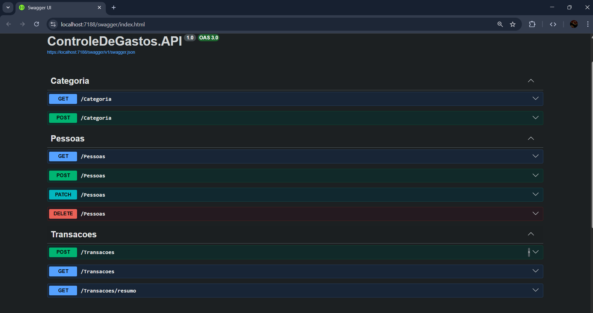
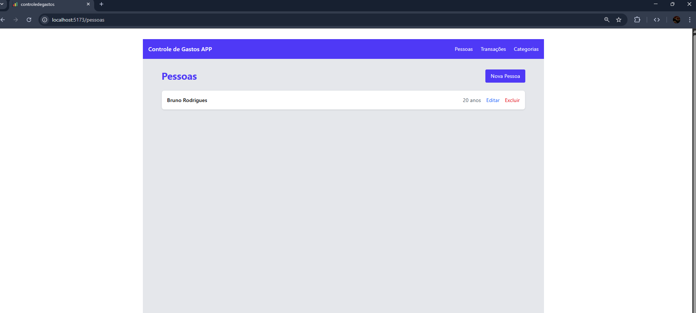
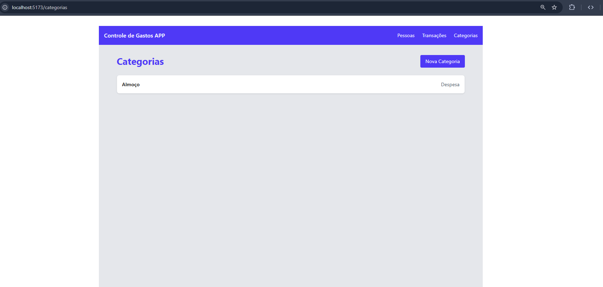

# ControleDeGastos

Aplicação full stack desenvolvida como parte de um teste técnico.

O sistema permite realizar o cadastro de **pessoas**, **categorias** e **transações financeiras**, além de visualizar o total de receitas, despesas e saldo de cada pessoa.

O projeto foi dividido em duas aplicações:

* **Backend:** API REST desenvolvida em .NET
* **Frontend:** Interface web desenvolvida com React

---

# Tecnologias Utilizadas

## Backend

* .NET 10
* ASP.NET Web API
* Entity Framework Core 
* SQLite
* Arquitetura baseada em DDD

### Frontend

- Node.js v24.12.0
- npm v11.6.2
- React v19.2.0
- Vite v7.3.1
- TypeScript v5.9.3
- TailwindCSS/vite v4.2.1

---

# Arquitetura

O backend foi estruturado com separação de responsabilidades entre domínio, aplicação e infraestrutura, utilizando princípios de **Domain Driven Design (DDD)**.

Estrutura simplificada:

```
API → Application → Domain → Infrastructure → Database
```
## API

A API possui documentação interativa utilizando **Swagger**, permitindo testar os endpoints diretamente pelo navegador.

### Swagger


---

# Funcionamento da Aplicação

O fluxo da aplicação segue a seguinte ideia:

Primeiro são cadastradas **pessoas**, que representam os usuários do sistema.

Depois podem ser cadastradas **categorias**, utilizadas para classificar as transações financeiras.

Com pessoas e categorias cadastradas, o usuário pode registrar **transações**, informando:

* descrição
* valor
* tipo (receita ou despesa)
* categoria
* pessoa associada

A aplicação também possui uma tela de **consulta de totais**, onde são exibidos:

* total de receitas por pessoa
* total de despesas por pessoa
* saldo final de cada pessoa

Ao final da listagem é exibido também o **total geral consolidado**.

---

# Interface

### Pessoas



### Categorias



### Transações


# Como executar o projeto

## Pré-requisitos

Certifique-se de ter instalado:

* .NET SDK - .Net 10.0.3
* Node.js - v24.12.0
* npm - 11.6.2

---

## Clonar o repositório

```bash
git clone https://github.com/bruDRKz/ControleDeGastos.git
cd ControleDeGastos
```

---

# Backend

1. Acesse a pasta do backend

```
cd backend
```

2. Restaurar dependências

```
dotnet restore
```

3. Executar a aplicação

```
dotnet run
```

A API será iniciada em uma URL semelhante a:

```
https://localhost:7188
```

---

# Banco de Dados

O projeto utiliza **SQLite**.

O banco de dados é criado automaticamente ao iniciar a aplicação.

Caso deseje visualizar ou editar o banco manualmente, é possível utilizar o **DB Browser for SQLite**.

---

# Frontend

1. Acesse a pasta do frontend

```
cd frontend
```

2. Instale as dependências

```
npm install
```

3. Execute o projeto

```
npm run dev
```

A aplicação estará disponível em:

```
http://localhost:5173
```
---

# Autor

Bruno Rodrigues — Desenvolvedor .Net
https://github.com/bruDRKz
